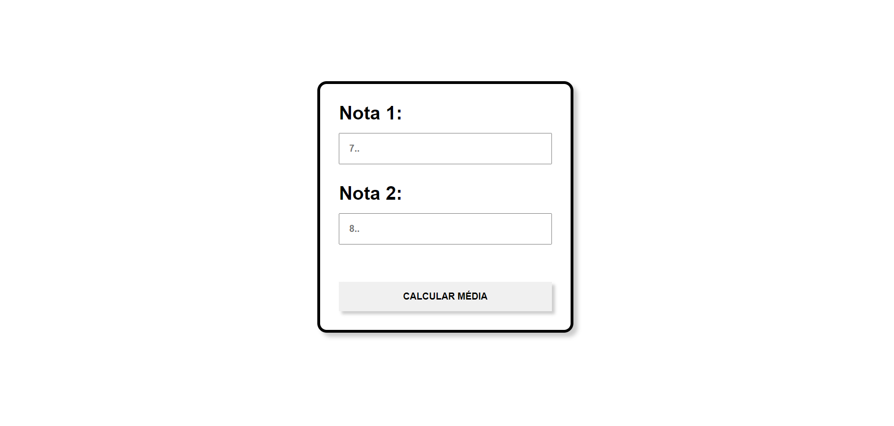

<h1 align="center"> Projeto Javascript - Notas</h1>

Projeto Javascript - Notas

---

 

  

---
## 💻 Tecnologias

Esse projeto foi desenvolvido com as seguintes tecnologias:

- HTML5
- CSS3
- Javascript
- Git e Github

---

## 🚧 Projeto

Projeto de Javascript onde o usuário Entra com 2 notas e o Programa retorna com a Média Aritmética.
Projeto realizado durante a matéria ILP-540 pela Fatec São Paulo. Projeto 3 de 5 projetos que devem ser entregues para complementar a nota do Semestre.

Você pode ver o site nesse link: [Javascript - Notas](https://nigerade.github.io/Javascript-Notas/)

--- 
